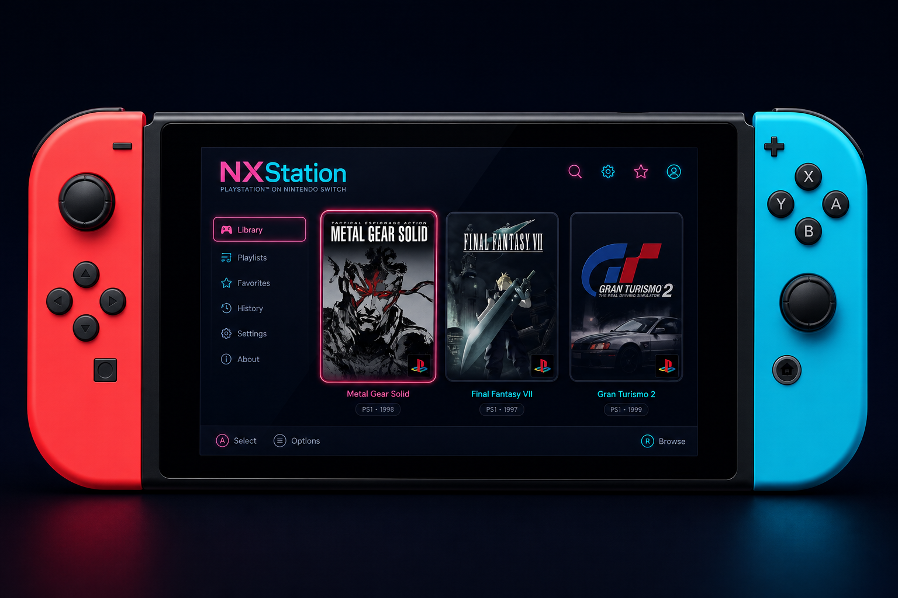
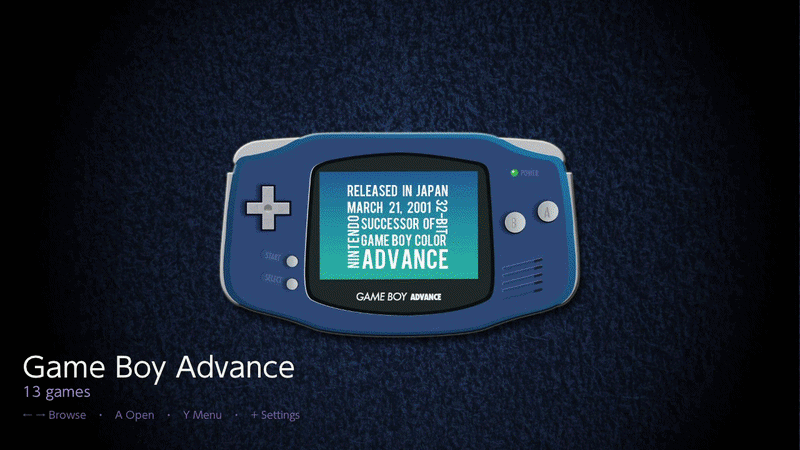
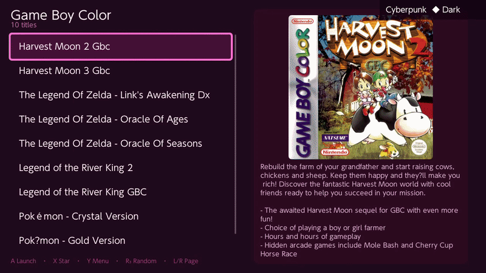
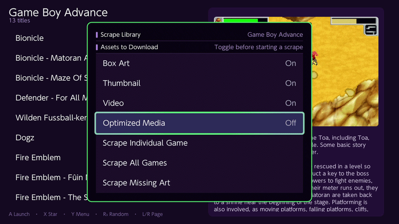
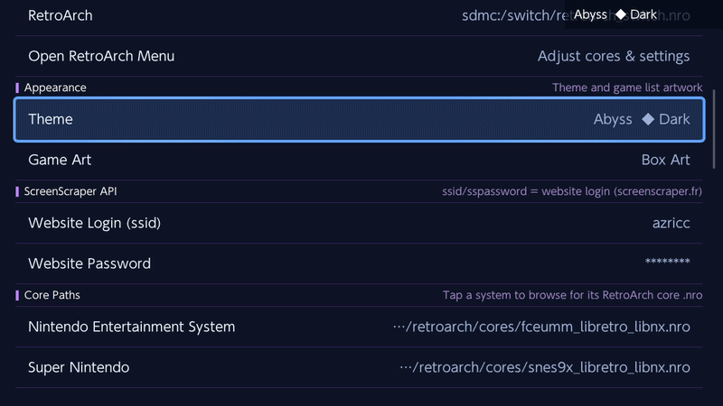
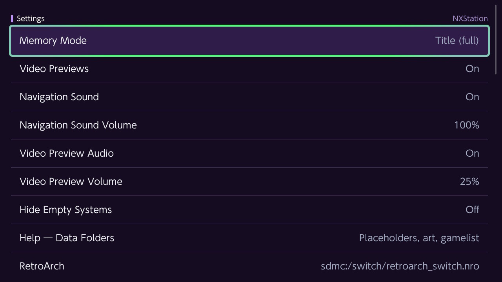

  

<h1 align="center"><a href="https://nxstation.com">NXStation</a></h1>

<strong>Your Retro Library. Elevated.</strong>

A fast, native, and customizable homebrew frontend built specifically for Nintendo Switch — browse your collection with real box art, scrape metadata and PDF manuals on-device, launch through RetroArch (or standalone cores), check for updates in Settings, and pick up exactly where you left off when you return.

**Website:** [nxstation.com](https://nxstation.com) · **Wiki:** [nxstation.com/wiki.html](https://nxstation.com/wiki.html) · **Blog:** [nxstation.com/blog.html](https://nxstation.com/blog.html)

**Current release:** [v0.2.3](https://github.com/jiraiya78/NXStation/releases/latest)

---

## What is NXStation?

NXStation is a Switch-native launcher for retro game libraries. It is not a web wrapper or a PC port squeezed onto handheld hardware. It is written in C++ for the Switch, tuned for controller and touchscreen, and designed to feel as responsive as the games you launch from it.

Whether you are curating a modest SD card collection or a multi-system archive, NXStation helps you **see** your library — box art, thumbnails, descriptions, video previews, and game manuals — without leaving the console.

---

## Built on six pillars

### Media collection compatibility

Fully compatible with ES-DE-style media layouts. Drop your collection’s artwork, thumbnails, and `gamelist.xml` into your roms folders and NXStation recognizes them immediately. No tedious re-import ritual.

### Batch scraping

Online scraper integration with [ScreenScraper.fr](https://www.screenscraper.fr/) — pull box art, screenshots, metadata, preview videos, and optional PDF manuals in a single pass, per game or across an entire system.

### RetroArch as backend

Launch a game from NXStation and RetroArch opens with the right core and ROM. Selected systems can also use standalone cores (for example Tico Dolphin / Azahar). When you close the game, NXStation restores your last browse position so you stay in the flow of picking what to play next.

### Deeply themeable

A base look plus many built-in color themes — dark and light palettes for different moods. Custom theme support lets you personalize beyond the defaults.

### Blazing fast

Native speed with no bloated webview lag. Lists scroll smoothly, art loads from local cache, and the UI stays out of your way when you are ready to play.

### Handheld native

Mapped for Joy-Con and Pro Controller, with touchscreen support where it matters. Built for real Switch hardware — not a desktop UI scaled down.

---

## Key capabilities

| | |
|---|---|
| **Dynamic media scraper** | Batch or per-title box art, thumbnails, descriptions, videos, and optional PDF manuals via ScreenScraper. |
| **In-app PDF manuals** | Read scraped manuals on Switch with cover/spread layout, zoom, and pan. |
| **Smart ROM library** | Scans ES-DE-style folder layouts, nested paths, favorites, and last-played lists. |
| **Playtime analytics** | Personality metrics and playtime insights from RetroArch runtime logs (Y menu). |
| **Video previews** | Hover-driven gameplay clips in the game list when running in full-memory mode. |
| **Search & navigation** | Find games quickly, jump by letter, random pick, and fast paging through large libraries. |
| **In-app updates** | Settings → **Check for Updates** downloads the latest `NXStation.nro` from GitHub Releases. |
| **Screensaver** | Idle showcase of your collection — dismiss with any button or launch straight into a game. |
| **Offline caching** | Scraped art, metadata, and manuals live on your SD card for browsing without Wi-Fi. |
| **Home Menu forwarder** | Optional install adds an NXStation icon on the Switch Home Menu and smooth return after play. |
| **Themeable interface** | Built-in theme set plus room for custom styling. |

*Custom background music and expanded soundtrack controls are planned for a future release.*

---

## The experience

**Browse** — System carousel with fade transitions, or list views per system. Favorites and last-played sections keep your regular picks close. Empty systems stay hidden by default until you add ROMs.

**Discover** — Rich metadata panels with box art, descriptions, optional video previews, and PDF manuals that bring each title to life before you launch.

**Launch** — One press opens RetroArch (or a standalone core) with the configured path. A short zoom/fade handoff frees memory for emulation.

**Return** — Close the game and land back in NXStation at the same system and scroll position — especially seamless when launched from the Home Menu forwarder.

**Personalize** — Swap themes, tune video and audio behavior, configure scraper options, set core paths, and adjust screensaver timing from Settings. Check playtime analytics from the main carousel **Y** menu.

---

## Supported systems

NXStation’s default configuration includes **28 systems**. Organize ROMs under `sdmc:/roms/` using the folder ID below (ES-DE-style layout).

| Folder ID | System |
|-----------|--------|
| `atari2600` | Atari 2600 |
| `atari5200` | Atari 5200 |
| `atari7800` | Atari 7800 |
| `atarilynx` | Atari Lynx |
| `atarijaguar` | Atari Jaguar |
| `atarist` | Atari ST |
| `nes` | Nintendo Entertainment System |
| `snes` | Super Nintendo |
| `n64` | Nintendo 64 |
| `gb` | Game Boy |
| `gbc` | Game Boy Color |
| `gba` | Game Boy Advance |
| `nds` | Nintendo DS |
| `3ds` | Nintendo 3DS |
| `gc` | GameCube |
| `wii` | Nintendo Wii |
| `megadrive` | Sega Mega Drive / Genesis |
| `mastersystem` | Sega Master System |
| `gamegear` | Sega Game Gear |
| `saturn` | Sega Saturn |
| `dreamcast` | Sega Dreamcast |
| `psx` | PlayStation |
| `psp` | PlayStation Portable |
| `pce` | PC Engine / TurboGrafx-16 |
| `cps1` | Capcom Play System I |
| `cps2` | Capcom Play System II |
| `neogeo` | Neo Geo |
| `arcade` | Arcade |

Additional platforms can be added in `settings/roms_config.json` (set `ssSystemId` from the [ScreenScraper system list](https://www.screenscraper.fr/index.php?action=systemesListe)) when a compatible RetroArch or standalone core is installed. GameCube / Wii / 3DS can use experimental standalone Tico cores — see the [wiki](https://nxstation.com/wiki.html).

---

## Getting started

Four steps from download to your library on Switch:

1. **Download** the latest `NXStation.nro` from [GitHub Releases](https://github.com/jiraiya78/NXStation/releases/latest) (or use Settings → **Check for Updates** once you already have v0.1.8+).

2. **Copy** it to your SD card at `switch/NXStation/NXStation.nro`.

3. **Launch via Title Override** — this is required. From the Switch Home Menu, hold **R** while opening any installed game title, then start NXStation from the Homebrew Menu that appears. Do not launch from the standard Homebrew Menu alone; NXStation needs full RAM for video previews, caching, and stable game launching.

4. **Add your ROMs** — on the SD card root, use a `roms` folder with one subfolder per system (for example `roms/snes/`, `roms/nes/`). NXStation scans on launch and groups games by system. After editing `settings/roms_config.json`, use **Scan Games / Rescan Libraries** to reload without a full restart.

Optional: install a **Home Menu forwarder** from Settings after starting in Title Override mode for a dedicated NXStation icon and smoother return-from-game behavior.

Full setup guides live on the [wiki](https://nxstation.com/wiki.html).

---

## Frequently asked questions

**Is NXStation free?**  
Yes. Download and use it at no cost.

**Can I migrate from ES-DE?**  
Yes. The same roms folder structure, media folders, and `gamelist.xml` files work with NXStation. Copy your collection layout and art — no separate export step.

**How do I scrape my library?**  
Connect to Wi-Fi, add your ScreenScraper.fr username and password in Settings, open a game list, and run a single-game or batch scrape from the scrape menu. Media is cached locally for offline browsing. PDF manuals are optional (off by default in the scrape menu).

**How do I update?**  
Settings → **Check for Updates** downloads the latest release over your installed NRO (internet required), or copy a new `NXStation.nro` manually to the same path. Settings and data on the SD card are kept.

**Why Title Override?**  
Applet Mode (standard Homebrew Menu launch) only exposes a small slice of system RAM. Video previews, artwork caching, and reliable core launching need the fuller memory environment Title Override provides.

**Can I run it from the Homebrew Menu without holding R?**  
Not for normal use. Applet Mode is blocked with an explanation dialog because the experience is severely limited there.

**Would you add RetroAchievements?**  
Uncertain at this time — no commitment either way yet.

**Can I help?**  
Bug reports and testing are always welcome. Contributions of background art and placeholders are especially useful. If you can spare support, [buy me a coffee on Ko-fi](https://ko-fi.com/V7C024E7UO) or [donate via GitHub Sponsors](https://github.com/sponsors/jiraiya78) helps keep development going.

---

## Support the project

NXStation is free and open source. If you enjoy it, consider supporting development:

- **Ko-fi:** [ko-fi.com/V7C024E7UO](https://ko-fi.com/V7C024E7UO)
- **GitHub Sponsors:** [github.com/sponsors/jiraiya78](https://github.com/sponsors/jiraiya78)

---

## Disclaimer

NXStation is an open-source frontend management tool. It does not contain game ROMs, copyrighted BIOS files, or proprietary Nintendo code. The developers are not affiliated with or endorsed by Nintendo Co., Ltd.

---

## Links

- **Website:** [nxstation.com](https://nxstation.com)
- **Wiki:** [nxstation.com/wiki.html](https://nxstation.com/wiki.html)
- **Blog:** [nxstation.com/blog.html](https://nxstation.com/blog.html)
- **Download:** [github.com/jiraiya78/NXStation/releases](https://github.com/jiraiya78/NXStation/releases/latest)
- **Source & issues:** [github.com/jiraiya78/NXStation](https://github.com/jiraiya78/NXStation)
- **Support:** [Ko-fi](https://ko-fi.com/V7C024E7UO) · [GitHub Sponsors](https://github.com/sponsors/jiraiya78)

---

## Credits & inspiration

NXStation draws inspiration from the ES-DE frontend philosophy and the broader retro library community.

Built with gratitude for **RetroArch**, **libnx**, the **Switch homebrew community**, **ScreenScraper**, **Borealis** (and the xfangfang fork), and everyone who tests, contributes, and keeps the homebrew scene alive.

If your work appears in or around this project and you would like attribution adjusted, please open an issue on GitHub.

---

*NXStation — not affiliated with Nintendo.*
